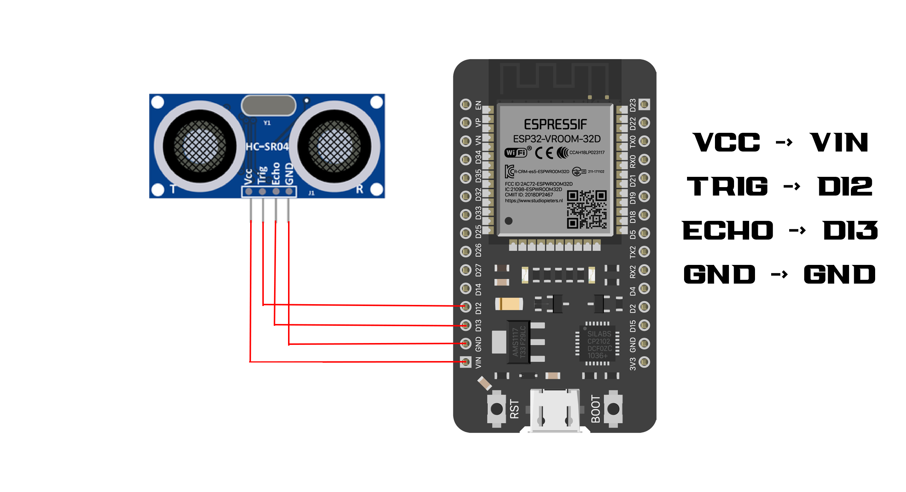
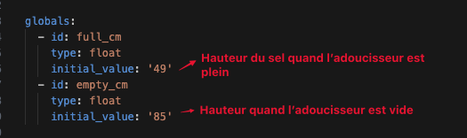

# Adoucisseur d'eau - Capteur de niveau de sel / Water Softener - Salt Level Sensor

Schémat de montage : 



Pour plus de simplicité j'ai utilisé une carte de type "terminal adapter for ESP32 30pin" : 


Les branchements se font de la même manière ils sont juste déportés.

Histoire de ne pas laisser pandouiller la carte dans le vide et de la laissé à la merci de la poussière, j'ai imprimé un petit boîtier pour la protéger : 


https://www.printables.com/model/595758-esp32-terminal-adapter-box

Idem pour le HC-sr04 : 


https://www.printables.com/model/42552-hc-sr04-minimal-case

Le code est fait pour qu'il soit le plus simple à comprendre et à configurer, vous n'avez que 2 valeurs à changer (sans compter sur la config habituelle, api, ota et ap ) pour l'adapter à votre modèle d'adoucisseur d'eau : 



Si vous voyez ceci dans les logs : 

```bash
[22:47:30][W][component:237]: Component template.sensor took a long time for an operation (52 ms).
[22:47:30][W][component:238]: Components should block for at most 30 ms.
```

	•	ESPHome recommande que chaque composant ne bloque pas l’exécution principale plus de 30 ms.
	•	Ici, le template sensor (Percentage) met 52 ms, ce qui dépasse la limite recommandée.
	•	C’est un avertissement, pas une erreur → Ça peut ralentir légèrement l’exécution des autres tâches, mais ça fonctionne toujours.

🔍 Pourquoi ce délai ?
	1.	Les logs ESP_LOGD prennent du temps 📋
	•	À chaque mise à jour, plusieurs messages sont envoyés via le port série/WiFi, ce qui peut ralentir l’exécution.
	2.	Le calcul du pourcentage implique des variables globales 🧮
	•	Accéder aux variables full_cm et empty_cm et faire des calculs flottants peut prendre un peu plus de temps.

📌 Est-ce grave ?

❌ Non, ce n’est pas une erreur critique.
📌 Si tu ne remarques aucun bug ni latence, tu peux ignorer cet avertissement.
✔️ Mais si tu veux optimiser, applique la version optimisée ci-dessus.

```yaml
- platform: template
  name: "Percentage"
  unit_of_measurement: '%'
  icon: mdi:percent
  lambda: |-
    float distance_cm = id(salt_level_distance).state;
    float full = id(full_cm);
    float empty = id(empty_cm);
    float range = empty - full;
    float filled = empty - distance_cm;
    float percentage = (filled / range) * 100.0;

    // Réduire le nombre de logs
    ESP_LOGD("DEBUG", "📏 Distance = %.2f cm | 🎯 full_cm = %.2f | 🛑 empty_cm = %.2f", distance_cm, full, empty);
    ESP_LOGD("DEBUG", "✅ Pourcentage = %.2f%%", percentage);

    return percentage;
```